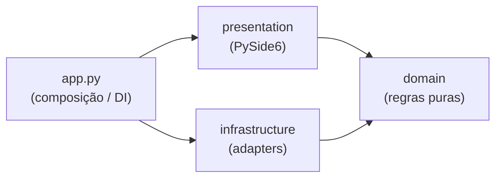

# Arquitetura — Vision Flow

Documento técnico: estrutura de pastas, camadas, dependências, threads e
integrações. Para escopo de negócio, ver [`PRD.md`](PRD.md). Para setup de
desenvolvimento, ver [`README.md`](README.md).

---

## 1. Stack

| Item | Escolha |
|------|---------|
| Plataforma | **Windows** (exclusivo; sem ramos Linux/WSL) |
| Linguagem | Python 3.12+ |
| Interface | PySide6 (LGPL) |
| Visão | opencv-python, numpy |
| Persistência | `sqlite3` nativo (sem ORM) |
| Empacotamento | `pyproject.toml` (setuptools) |
| Lint/format | `ruff` (`ruff check src/` sem erros) |

---

## 2. Três camadas

Dependências **unidirecionais**:



| Camada | Responsabilidade | Pode importar |
|--------|------------------|---------------|
| **domain** | Entidades, contratos (ports), use cases | stdlib, `numpy` |
| **infrastructure** | SQLite, câmera, paths de runtime, logging | `domain`, stdlib, ctypes, sqlite3 |
| **presentation** | Telas, widgets, temas, workers Qt, `QtImageStorage` | `domain` (+ `infrastructure` **somente** em `app.py`) |

Regras:

- **`domain` é pura** — sem PySide6, sqlite3, ctypes, `presentation` nem `infrastructure`.
- **`infrastructure` não importa PySide6.**
- **`presentation` não importa `infrastructure`** fora da raiz de composição (`app.py`), que monta o grafo e injeta dependências.

---

## 3. Estrutura de pastas

```
vision-flow/
├── pyproject.toml             # version = fonte única da versão do pacote
├── .github/workflows/         # ci.yml (ruff), release.yml (instalador)
├── packaging/
│   ├── visionflow.spec        # PyInstaller (modo onedir)
│   ├── installer.iss          # Inno Setup
│   └── visionflow.ico         # gerado em build (gitignore)
├── scripts/
│   ├── build_installer.py     # PyInstaller + Inno Setup
│   ├── generate_brand_svgs.py # PNG → SVG de ícone e wordmark
│   └── sync_opt_runtime.py    # Atualiza runtime OPT a partir do fabricante
├── data/                      # runtime: visionflow.db, captures/, recordings/, thumbs/
│                              #   (datasets YOLO ficam no .db; imagens reaproveitam captures/)
└── src/visionflow/
    ├── __main__.py
    ├── app.py                 # DI + MainApplication + main()
    ├── branding.py            # APP_DISPLAY_NAME, APP_SLUG, paths do instalador
    ├── version.py             # app_version() via importlib.metadata
    ├── domain/
    │   ├── camera_backends.py # BACKEND_* + BackendDescriptor + BACKEND_REGISTRY
    │   ├── entities/          # Capture, Recording, CameraConfig, DeviceInfo, LogEntry,
    │   │                      # DiscoverContext, FilteredPage, video_path,
    │   │                      # yolo (YoloDataset/Class/Image/Annotation/Export*)
    │   ├── contracts/         # CameraPort, TriggerCapableCamera, repositórios,
    │   │                      # YoloRepository, ImageStorage, ThumbnailCache, CameraError,
    │   │                      # VideoRecorderPort
    │   ├── gallery_defaults.py # THUMBNAIL_MAX_WIDTH/HEIGHT
    │   ├── yolo_dataset_layout.py # layout Ultralytics (split, labels, data.yaml)
    │   ├── yolo_export_format.py  # perfis de exportação v8/v11/v26
    │   └── use_cases/         # CaptureService, CaptureExportService,
    │                          # RecordingService, RecordingExportService,
    │                          # YoloDatasetService, YoloExportService,
    │                          # CameraConfigService, LogService, connect_saved,
    │                          # devices (criteria_from_config, find_saved_device)
    ├── infrastructure/
    │   ├── paths.py           # DB_PATH, CAPTURES_DIR, RECORDINGS_DIR, THUMBS_DIR
    │   ├── logging_config.py  # console + app_logs (SQLite)
    │   ├── db_log_handler.py
    │   ├── persistence/
    │   │   ├── database.py    # schema + migrações
    │   │   ├── base.py        # SqliteRepositoryBase, build_date_range_clause
    │   │   └── repositories.py
    │   ├── camera/
    │   │   ├── factory.py     # registry plugável: create_camera, backend_available
    │   │   ├── native.py      # resolve SciCamSDK.dll, PATH, GENICAM_GENTL64_PATH
    │   │   ├── opencv_base.py # OpenCvCameraBase (UVC + vídeo)
    │   │   ├── opencv_frames.py
    │   │   ├── opt/
    │   │   │   ├── opt_camera.py
    │   │   │   ├── opt_discovery.py / opt_payload.py / opt_trigger.py
    │   │   │   ├── _sdk/      # bindings ctypes (vendor)
    │   │   │   └── runtime/   # DLLs Git LFS
    │   │   ├── uvc/           # UvcCamera (OpenCV DirectShow)
    │   │   └── video/         # VideoCamera (arquivo de vídeo em loop)
    │   ├── thumbnails/        # DiskThumbnailCache, generators (OpenCV)
    │   ├── video/             # OpenCvVideoRecorder (MP4 via VideoWriter)
    └── presentation/
        ├── paths.py           # ICONS_DIR, IMAGES_DIR, THEMES_DIR
        ├── navigation.py      # NAV_SECTIONS, NAV_FOOTER (menu lateral)
        ├── trigger_labels.py  # textos PT-BR do modo trigger
        ├── window_constraints.py  # dimensões mínimas; BOTTOM_PANEL_HEIGHT
        ├── camera_controller.py   # fachada + CameraSessionState interno
        ├── camera_session_state.py
        ├── camera_commands.py     # Protocol CameraCommands (widgets)
        ├── gallery_zip_export_controller.py  # ZIP na thread principal (MainThreadBatch)
        ├── gallery_import_controller.py        # importação na thread principal
        ├── bulk_delete_controller.py           # exclusão em lote na thread principal
        ├── yolo_export_controller.py         # ZIP YOLO (Ultralytics) na thread principal
        ├── yolo_export_labels.py           # rótulos e tooltips dos perfis YOLO
        ├── filtered_gallery_controller.py    # paginação + filtro + seleção (galerias)
        ├── selection_model.py                # estado "selecionar/desmarcar todas"
        ├── media_thumbnail_loader.py         # loader único compartilhado (QThread)
        ├── discover_context_parser.py  # parse_discover_context (payload Qt)
        ├── format_utils.py
        ├── qt_image_storage.py
        ├── window_chrome.py     # flags de popup modal nativo (Windows)
        ├── system_dialogs.py    # QFileDialog temático (Salvar captura)
        ├── layouts/, widgets/, screens/, workers/, themes/
        │   ├── screens/       # MainScreen, CapturesScreen, RecordingsScreen,
        │   │                  # DatasetsScreen, LogsScreen,
        │   │                  # CameraScreen, FilteredGalleryScreen (base)
        │   ├── workers/       # CameraWorker, RecordingSession e jobs Qt
        │   └── widgets/
        │       ├── camera_wizard/   # CameraModelStep, DevicesStep, ConnectionStep
        │       ├── main_recent_panel.py  # abas Capturas/Gravações na Principal
        │       ├── video_playback_controls.py  # playback na Principal (backend vídeo)
        │       ├── recording_detail_dialog.py  # popup de gravação (QMediaPlayer)
        │       ├── thumbnail_gallery_grid.py, thumbnail_media_strip.py
        │       ├── capture_gallery_grid.py, recording_gallery_grid.py
        │       ├── dataset_image_gallery_grid.py  # galeria com legenda de classes
        │       ├── annotation_dialog.py, annotation_canvas_widget.py  # anotação YOLO
        │       ├── capture_picker_dialog.py, class_editor_dialog.py
        │       ├── capture_strip.py, recording_strip.py, pagination_bar.py
        │       ├── list_screen_header.py, quick_date_filter_bar.py
        │       ├── date_range_picker.py, date_filter_utils.py
        │       └── FeedbackBanner, TriggerCaptureToolbar, …
        └── resources/         # ícones SVG, imagens
            ├── icons/         # icon_app, icon_nav_*, …
            └── images/        # logo.svg (wordmark horizontal)
```

Recursos empacotados: `[tool.setuptools.package-data]` em `pyproject.toml`
(`presentation/resources/**`, `presentation/themes/*.qss`).

**Marca:** `icon_app.svg` (janela/taskbar e
`.ico` Windows), `logo.svg` (wordmark na barra superior). Identidade central em
:mod:`visionflow.branding` (`APP_DISPLAY_NAME`, `APP_SLUG`).

---

## 4. Composição e injeção de dependências

`app.py` é a **única** raiz de composição:

1. `ensure_native_lib_path()` — bootstrap das DLLs OPT.
2. `ensure_data_dirs()` — cria `data/`.
3. `initialize()` + `attach_db_log_handler()` — schema SQLite (inclui `app_logs`)
   e handler que persiste `LogRecord` via `SqliteLogHandler`.
4. `build_dependencies()` — monta repositórios SQLite (incl.
   `SqliteYoloRepository`, `SqliteRecordingRepository`), `QtImageStorage`,
   `CvImageFileImporter`, `DiskThumbnailCache`, `CaptureService`,
   `RecordingService`, `YoloDatasetService`, `CameraConfigService`, `LogService`,
   `create_camera`, `sdk_available`, `backend_available`; `LogService.prune_old_logs()`
   na inicialização (retenção padrão 90 dias).
5. `MainApplication(deps)` — cria `MediaThumbnailLoader` único
   (`thumbnail_cache.as_reader()`), injeta `OpenCvVideoRecorder` em
   `CameraController` (via `CameraWorkerFactories`) e em
   `DefaultLayout`/`build_screen_factories`.
6. `build_screen_factories()` — mapa `page_id → factory` para telas com DI
   (`presentation/screens/factory.py`).

Telas recebem serviços prontos via factory; nunca instanciam repositórios ou
adapters diretamente. Erros de câmera na UI usam `presentation/camera_feedback.py`.

---

## 5. Contratos (ports) e adapters

| Contrato (`domain/contracts/`) | Implementação |
|--------------------------------|---------------|
| `CameraPort` | `OptCamera` (opt), `UvcCamera` (uvc) ou `VideoCamera` via `factory.py` |
| `TriggerCapableCamera` | `OptCamera` (GenICam trigger); UVC/vídeo implementam só `CameraPort` |
| Exceções de câmera | `CameraError`, `IncompleteFrameError`, `TriggerWaitError` (`domain/contracts/camera.py`) |
| `CaptureRepository` | `infrastructure/persistence/SqliteCaptureRepository` |
| `RecordingRepository` | `infrastructure/persistence/SqliteRecordingRepository` |
| `CameraConfigRepository` | `infrastructure/persistence/SqliteCameraConfigRepository` |
| `ImageStorage` | `presentation/qt_image_storage.QtImageStorage` (exige Qt) |
| `LogRepository` | `infrastructure/persistence/SqliteLogRepository` |
| `ThumbnailCache` | `infrastructure/thumbnails/DiskThumbnailCache` (`remove` + `as_reader()` → `data/thumbs/`) |
| `YoloRepository` | `infrastructure/persistence/SqliteYoloRepository` (datasets, classes, imagens, anotações) |
| Exportação ZIP (capturas) | `CaptureExportService` (`domain/use_cases/capture_export.py`); delegado por `CaptureService.write_zip` |
| Exportação ZIP (gravações) | `RecordingExportService` (`domain/use_cases/recording_export.py`); delegado por `RecordingService.write_zip` |
| Exportação ZIP (datasets YOLO) | `YoloExportService.write_zip` (`domain/use_cases/yolo_export.py`); payload via `YoloDatasetService.build_export_payload`; perfis em `domain/yolo_export_format.py` |
| `VideoRecorderPort` | `infrastructure/video/OpenCvVideoRecorder` (MP4 via OpenCV `VideoWriter`) |

Novas dependências externas: contrato no `domain`, implementação na
`infrastructure` (ou na `presentation` quando exigir Qt). Erros de hardware sobem
como `CameraError`; a `presentation` não conhece exceções do SDK.

---

## 6. Threads e ciclo de vida

- A **thread da GUI nunca bloqueia** para I/O pesado ou captura: use `QThread` ou
  `QRunnable`. **Exceções documentadas:** importação, exclusão e exportação ZIP
  nas galerias rodam na thread principal (SQLite + logging não são seguros em
  worker); o `LoadingDialog` modal e `pump_ui_during_job` mantêm o popup
  responsivo entre itens, mas a UI fica indisponível para interação até concluir.
- `MediaThumbnailLoader` — instância única em `MainApplication`; lê miniaturas
  via `DiskThumbnailCache.as_reader()` em thread dedicada; encerre com
  `thumbnail_loader.shutdown()` no `closeEvent`.
- Workers ↔ UI: **signals e slots**. Payloads grandes (`numpy`) podem exigir
  cópia explícita — evite buffers mutáveis compartilhados.
- `CameraController` mantém um `CameraWorker` em `QThread`; encerre com
  `controller.shutdown()` no `closeEvent` (``BlockingQueuedConnection`` para
  parar timer/desconectar na thread do worker antes de ``quit()``).
- Preview ao vivo (OPT): estratégia SDK ``Latest``; timeouts de grab ~200 ms
  (preview), ~15 s (captura única / escuta de trigger). UVC: timer ~33 ms +
  ``VideoCapture.read()`` no adapter OpenCV.
- Modo trigger (somente ``TriggerCapableCamera`` com ``supports_trigger=True``):
  worker recusa ativação em UVC/vídeo; para OPT, para o timer de live, loop
  ``grab(single=True)`` com reagendamento em ``TriggerWaitError``; emite
  ``frame_ready`` + ``capture_ready`` por evento. ``grab_once`` recusa se o
  trigger estiver ativo.
- Sinal ``connected(bool)`` do worker reflete ``camera_supports_trigger(camera)``
  da instância conectada; o controller expõe ``supports_trigger`` à UI.
- Reconexão salva: ``CameraWorker.connect_saved`` delega a
  ``resolve_saved_device`` (`domain/use_cases/connect_saved.py`).
- ``CameraController.set_trigger_mode(False)`` **sempre** enfileira
  ``stop_trigger_listen`` (evita corrida ao desligar durante *Habilitando...*).
- Fases expostas à UI via ``trigger_phase_changed``: ``idle``, ``enabling``,
  ``active``, ``disabling`` (complementa ``trigger_mode_changed``).
- Frames incompletos no preview: ``IncompleteFrameError``; espera de trigger:
  ``TriggerWaitError`` — ambas subclasses de ``CameraError``, ignoradas ou
  reagendadas no worker sem derrubar o loop.

Fluxo da câmera na UI:

```
Telas → CameraController → CameraWorker (QThread) → CameraPort (OptCamera | UvcCamera | VideoCamera)
```

Persistência de capturas:

```
Telas → CaptureService (domain) → CaptureRepository + ImageStorage
  (`QtImageStorage` grava JPEG em `data/captures/`; `list_filtered` / `count_filtered`
  filtram por intervalo de datas; faixa da Principal usa capturas do dia corrente
  com limite STRIP_PREVIEW_LIMIT = 10)
```

Gravação de vídeo (tela Principal):

```
MainScreen → CameraController.start_recording / stop_recording
  → CameraWorker (QThread) → RecordingSession → VideoRecorderPort (OpenCvVideoRecorder)
  → frames RGB8 do preview → MP4 em data/recordings/{timestamp}.mp4
  → recording_stopped → RecordingService.register → RecordingRepository (SQLite)
  (gravação recusada com trigger ativo; arquivo sem frames é descartado)
```

Persistência de gravações:

```
Telas → RecordingService (domain) → RecordingRepository
  (`list_filtered` / `count_filtered` por intervalo de datas; faixa da Principal
  usa gravações do dia corrente com limite STRIP_PREVIEW_LIMIT = 10)
```

Edição de capturas (popup de detalhe → **Recortar** / **Redimensionar**):

```
CaptureDetailDialog → CaptureCropDialog | CaptureResizeDialog (presentation)
  → crop/resize via `image_utils` (QImage)
  → Atualizar: CaptureService.replace_image → ImageStorage.overwrite
     + CaptureRepository.update_dimensions
  → Gerar nova captura: CaptureService.save (novo arquivo + registro)
```

Exportação ZIP (telas Capturas e Gravações — itens selecionados):

```
FilteredGalleryScreen → BackgroundJobController (compartilhado; um job por vez)
  → GalleryZipExportController → MainThreadBatchController (thread principal)
  → QFileDialog (save; nome sugerido com GUID)
  → list_by_ids + write_zip(on_progress) + pump_ui_during_job
  → CaptureService.write_zip | RecordingService.write_zip → arquivos em data/
  (arcnames via zip_arcname por ``id``)
```

Datasets YOLO (tela Datasets):

```
DatasetsScreen → YoloDatasetService (domain) → YoloRepository (SQLite)
  classes/imagens/anotações; pontos normalizados em yolo_annotations.points (TEXT)
  CapturePickerDialog reaproveita FilteredGalleryController (filtro + paginação)
  Anotação: AnnotationDialog → AnnotationCanvasWidget (retângulo/polígono;
    mover/redimensionar a forma selecionada) → set_annotations
```

Exportação ZIP YOLO (tela Datasets — dataset inteiro):

```
DatasetsScreen → YoloExportController → MainThreadBatchController (thread principal)
  → QFileDialog (save .zip) → build_export_payload (retângulo → 4 vértices)
  → YoloExportService.write_zip(export_format, on_progress) + pump_ui_during_job
  → images/{train,val} + labels/{train,val} + data.yaml + classes.txt
  (perfis v8/v11/v26 ajustam data.yaml; split ~20% val; imagens ausentes ignoradas;
   ZIP vazio é removido; diálogo de feedback só em erro/aviso)
```

Miniaturas (galerias, faixa da Principal):

```
Telas → MediaThumbnailLoader (QThread única; injetado em app.py)
  → DiskThumbnailCache.read_thumbnail (lazy; lock por digest)
  → data/thumbs/{sha256}.jpg + .meta (invalidação por mtime_ns do original)
  → ThumbnailGalleryGrid | ThumbnailMediaStrip (cache em memória por sessão)
  → CaptureService.delete_many | RecordingService.delete_many invalida cache (remove)
```

Exclusão em lote (telas Capturas e Gravações):

```
FilteredGalleryScreen → BackgroundJobController (compartilhado; flag _busy)
  → BulkDeleteController → MainThreadBatchController (thread principal)
  → run_with_ui_pump: delete_many([id]) por item + pump_ui_during_job
  → CaptureService.delete_many | RecordingService.delete_many (domain)
  (``list_filtered_ids`` sob demanda ao clicar em Selecionar todas)
```

Importação de arquivos (telas Capturas e Gravações — botão Adicionar):

```
FilteredGalleryScreen → GalleryImportController
  → QFileDialog temático (open; multi-seleção; parent = janela principal)
  → MainThreadBatchController + LoadingDialog (thread principal)
  → run_with_ui_pump: import_from_files([path]) por item + pump_ui_during_job
  → CaptureService.import_from_files → CvImageFileImporter (OpenCV/JPEG)
     | RecordingService.import_from_files → RecordingRepository.import_external_file
     (``shutil.copy2`` para ``data/recordings/`` quando externo)
  → FileImportResult (added / failed / skipped); recarrega galeria; banner de feedback
```

Persistência e consulta de logs:

```
logging → SqliteLogHandler → LogRepository → app_logs
Telas → LogService (domain) → LogRepository
  (filtro por dia + texto; LOG_DISPLAY_LIMIT = 5_000 na UI;
   LOG_EXPORT_LIMIT = 100_000 no CSV; handler ignora loggers de persistência
   e trunca mensagem/exceção para evitar loops e registros enormes)
```

Navegação com câmera ativa:

```
DefaultLayout._show_page → confirm_disconnect_camera (se Principal/Câmera
  e estado CONNECTED ou CONNECTING) → CameraController.disconnect
```

---

## 7. Câmera (adapters OPT, UVC e vídeo)

- Contrato base: `domain/contracts/camera.CameraPort` — `discover`, `select_device`,
  `connect`, `disconnect`, `grab`, `is_connected`.
- Trigger (ISP): `TriggerCapableCamera(CameraPort)` — `set_trigger_mode`,
  `supports_trigger`; implementado apenas por `OptCamera`. Helper
  `camera_supports_trigger(camera)` para worker/controller.
- Metadados por backend: `BackendDescriptor` + `BACKEND_REGISTRY` em
  `domain/camera_backends.py` (``supports_trigger``, ``discover_mode``,
  textos do wizard). Evita ``if backend ==`` espalhado na UI e nos use cases.
- Contexto de descoberta: `domain/entities/discover_context.DiscoverContext`
  (campo ``video_path`` para o backend ``video``); demais backends ignoram.
  Parsing de payload Qt: `presentation/discover_context_parser.py`.
- Fábrica: `infrastructure/camera/factory.py` — registry
  ``_BACKEND_FACTORIES`` mapeia cada ``BACKEND_*`` para factory e
  ``backend_available``. Backend inválido levanta ``UnknownCameraBackendError``.
- O backend do assistente (`CameraController.discover`) e o campo ``backend`` em
  ``CameraConfig`` definem qual adapter o ``CameraWorker`` instancia; troca de
  backend descarta a instância anterior (``disconnect`` só se conectada).
- ``CameraConfig`` persiste ``backend``, ``device_index``, ``opencv_index`` (UVC)
  e ``video_path`` (vídeo). Migrações incrementais em ``database._migrate_schema``.
- ``discover`` retorna ``domain.entities.DeviceInfo``; UVC preenche
  ``extra["opencv_index"]``; vídeo preenche ``extra["video_path"]``.
- Conversão BGR/mono → RGB8 compartilhada: ``infrastructure/camera/opencv_frames``.
- Normalização de caminho de vídeo: ``domain/entities/video_path.normalize_video_path``.

### OPT (`OptCamera`)

- Implementação em `infrastructure/camera/opt/opt_camera.py` via **ctypes**;
  módulos auxiliares: ``opt_discovery``, ``opt_payload``, ``opt_trigger``.
  Alias legado: ``OPTCam = OptCamera``.
- Frames: `numpy.ndarray` bruto; conversões/`cv2` **fora** do adapter.
- GenICam: exposição, pixel, GigE e ``TriggerSource`` ficam no software OPT;
  o app controla apenas ``TriggerMode`` (On/Off) via :meth:`set_trigger_mode`.
  Na conexão o adapter **não** altera parâmetros GigE nem enums além de garantir
  ``TriggerMode=Off`` antes de ``StartGrabbing``.
- Ao ativar trigger: estratégia SDK ``Upcoming``, ``ClearPayloadBuffer``,
  drenagem de frames residuais (timeout curto) — evita captura espúria do buffer
  do live. Ao desativar: restaura ``Latest`` e timeout de preview.
- Preview ao vivo e modo trigger são **mutuamente exclusivos** no worker.
- ``discover()`` recusa busca com câmera conectada (evita invalidar o handle).
- SDK: runtime Win64_x64 em `infrastructure/camera/opt/runtime/` (fonte
  primária, versionado no repo via Git LFS). `native.ensure_native_lib_path()`
  registra a raiz e subpastas (`AHD/`, `SciBridgeModule/`) em `PATH` e
  `GENICAM_GENTL64_PATH`. Só marca o bootstrap como concluído (`_state.prepared`)
  após localizar `SciCamSDK.dll`, permitindo nova tentativa se o runtime ainda
  não estava disponível no boot.
  Fallback legado: runtime OPT em `C:\Program Files (x86)\OPTMV\...` apenas se o
  runtime embutido estiver vazio. Atualização: `python scripts/sync_opt_runtime.py`.
- Resiliência: falhas viram `CameraError`; startup seguro sem hardware.

### UVC (`UvcCamera`)

- Herda ``OpenCvCameraBase``; implementação em `infrastructure/camera/uvc/`.
- OpenCV ``cv2.VideoCapture`` com backend DirectShow no Windows.
- Descoberta: sonda índices `0..7`; reconexão prioriza ``opencv_index`` gravado
  (fallback ``device_index``).
- Frames: `numpy.ndarray` RGB8 via ``opencv_frames.frame_to_rgb8``.
- Implementa só ``CameraPort`` (sem trigger). Worker e controller bloqueiam
  escuta de trigger.

### Vídeo (`VideoCamera`)

- Herda ``OpenCvCameraBase``; implementação em `infrastructure/camera/video/`.
- OpenCV ``cv2.VideoCapture`` em arquivo local.
- Descoberta: ``DiscoverContext.video_path`` informado pelo wizard ou pela
  configuração salva; retorna um único ``DeviceInfo``.
- **Wizard:** preview em loop ao fim do arquivo (``set_loop_on_end(True)``).
- **Principal:** playback controlado via :class:`VideoPlaybackPort` — pausar,
  seek ±5 s e slider; fim do vídeo pausa no último frame (sem loop).
- Caminhos normalizados com ``normalize_video_path`` (domain).
- Implementa :class:`VideoPlaybackPort` (sem trigger); captura manual na
  Principal funciona como nas demais fontes (frame exibido).
- Na UI o botão Trigger permanece visível, porém desabilitado (tooltip em
  ``trigger_labels.py``). Controles de vídeo só na tela Principal.

---

## 8. Convenções de código

### Imports e pacote

- Imports Qt explícitos dos submódulos PySide6 (`from PySide6.QtWidgets import QFrame`).
- Sem `import *` nem agregadores (`qt_core`).
- Pacote único `visionflow`; imports absolutos de primeira parte.
- Idioma: **PT-BR** em UI, logs, comentários e docs; **inglês** em código
  executável (nomes, tabelas SQLite, chaves de dict).

### Caminhos

- UI: `presentation/paths.py` (`ICONS_DIR`, `THEMES_DIR`, …).
- Runtime/binários: `infrastructure/paths.py` (`DB_PATH`, `CAPTURES_DIR`, …).
- O **`domain` não referencia caminhos**.

### Temas e QSS

- `ThemeManager`: `global.qss` (dimensões/estrutura) + `light.qss`/`dark.qss`
  (paleta). Persistência em `QSettings`; sinal `theme_changed`.
- Tema salvo fora do manager: `ThemeManager.saved_theme()` / `is_saved_dark()`.
- QSS dinâmico: `presentation/style_utils.py` (`repolish`, `set_property`).
- Ícones SVG: tingimento via `icon_colors.py` / `nav_icon_colors.py`; tamanhos
  em `icon_sizes.py` (QSS não dimensiona SVG rasterizado).
- Navegação: `presentation/navigation.py` (fonte de verdade do menu). Itens atuais:
  Principal, Capturas, Gravações, Datasets, Câmera e Logs
  (`NAV_SECTIONS`). Rodapé
  da sidebar reservado para itens futuros (`NAV_FOOTER` vazio). Configurações e
  Ajuda estão no roadmap (`PRD.md` §3.2), sem telas no código.
- Assistente Câmera: widgets em `presentation/widgets/camera_wizard/`; metadados
  de backend via `BackendDescriptor` (sem branching por string na tela).
- Telas Capturas/Logs: cabeçalho (`ListScreenHeader`), filtros rápidos
  (`QuickDateFilterBar`), intervalo de datas (`DateRangePicker` em Capturas).
- Galerias filtradas (Capturas, Gravações e o seletor de imagens de Datasets)
  compartilham `FilteredGalleryController` (paginação + filtro de data +
  seleção); o estado "selecionar/desmarcar todas" fica em `SelectionModel`,
  reutilizado também pela seleção de imagens da tela Datasets. A barra de
  imagens de Datasets usa `objectName` `datasets_images_toolbar` (mesmo estilo
  de `datasets_toolbar`).
- Formatação de datas ISO em capturas: `presentation/format_utils.py`.
- Banner de feedback: `presentation/widgets/feedback_banner.py` (`FeedbackBanner`)
  reutilizado nas telas Capturas e Logs para avisos de exportação ou erro.
- Dimensões em `global.qss`; cores no tema ativo. Exceção documentada:
  ``BOTTOM_PANEL_HEIGHT`` em `window_constraints.py` — altura compartilhada entre
  ``CaptureStrip`` e ``sidebar_footer`` (padding espelha ``global.qss``).
- Botões Capturar + Trigger + Gravar: widget reutilizável
  ``presentation/widgets/trigger_capture_toolbar.py`` (Capturar/Trigger); botão
  Gravar em ``MainScreen``; textos em ``trigger_labels.py``. Usado em
  ``MainScreen`` (assistente Câmera é só preview).
- Controles de vídeo na Principal: ``video_playback_controls.py`` (somente backend
  ``video``); popup de gravação usa ``QMediaPlayer`` em
  ``recording_detail_dialog.py``.
- Barra superior (`title_bar.py`): wordmark (`logo.svg`), versão (`app_version()`),
  subtítulo *Sistema de visão computacional para coleta de imagens e geração de datasets YOLO*; alternância de tema. Ícone da janela:
  `icon_app.svg` em `app.py` (`setWindowIcon`).

### Diálogos e popups

- **Detalhe de captura** — `presentation/widgets/capture_detail_dialog.py`
  (`CaptureDetailDialog`): popup modal com barra de título nativa do Windows
  (`apply_native_dialog_flags` em `window_chrome.py`); preview da imagem com fundo
  preto (excluído de `apply_dialog_theme`), ações *Baixar* e *Excluir*; aberto via
  `capture_actions.show_capture_detail` (Principal e tela Capturas).
- **Detalhe de gravação** — `presentation/widgets/recording_detail_dialog.py`
  (`RecordingDetailDialog`): popup modal nativo; reprodução via `QMediaPlayer`,
  ações *Baixar* e *Excluir*; aberto via `recording_actions.show_recording_detail`
  (Principal e tela Gravações).
- **Salvar / exportar** — `presentation/system_dialogs.py` (`save_file_path`):
  `QFileDialog` com paleta do tema ativo (captura individual, CSV de logs, ZIP).
- **Confirmação temática** — `confirm_disconnect_camera` usa `_ThemedMessageBox`
  (botões Sim/Não, paleta claro/escuro, largura mínima fixa). `apply_dialog_theme`
  repolisha widgets do diálogo exceto `capture_detail_preview`.
- A janela principal mantém chrome customizado (`title_bar.py`); popups de
  detalhe delegam decoração ao sistema operacional.

### Binding vendorizado

`infrastructure/camera/opt/_sdk/` é código de terceiros, excluído do `ruff`
(`extend-exclude` no `pyproject.toml`).

---

## 9. Versionamento, empacotamento e CI

### Versão da aplicação

| Onde | Papel |
|------|-------|
| `pyproject.toml` → `[project] version` | Fonte única editada em releases |
| `version.py` → `app_version()` | Leitura em runtime (`importlib.metadata`) |
| `scripts/build_installer.py` | Lê `pyproject.toml` para nomear o instalador e passar `MyAppVersion` ao Inno Setup |
| UI (`title_bar.py`, `app.py`) | Exibe `v{app_version()}` |

Tag Git de release: `v` + versão sem prefixo (ex.: `1.0.1` → tag `v1.0.1`).

### Pipeline de build

1. `ensure_opt_runtime()` — exige `SciCamSDK.dll` (Git LFS).
2. PyInstaller (`packaging/visionflow.spec`) → `dist/VisionFlow/`.
3. Inno Setup (`packaging/installer.iss`) → `dist/VisionFlow-Setup-<versão>.exe`.

`ensure_app_icon()` gera `packaging/visionflow.ico` a partir de
`icon_app.svg` quando o `.ico` não existir ou for mais antigo que o SVG.
O instalador inclui `SetupIconFile` e defines gerados em `branding.iss`
(via `scripts/build_installer.py` a partir de :mod:`visionflow.branding`).

### GitHub Actions

| Workflow | Gatilho | Ação |
|----------|---------|------|
| `ci.yml` | push `main`, PR | `ruff check src/` |
| `release.yml` | tag `v*.*.*` ou manual | build completo; Release ou artefato |

Detalhes operacionais (tags, download do instalador vs. source zip): [`README.md`](README.md).
